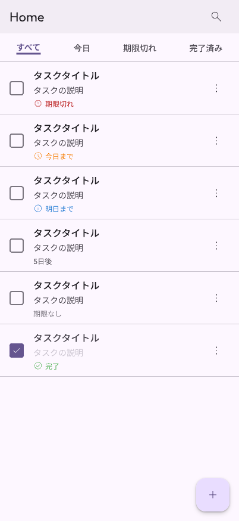
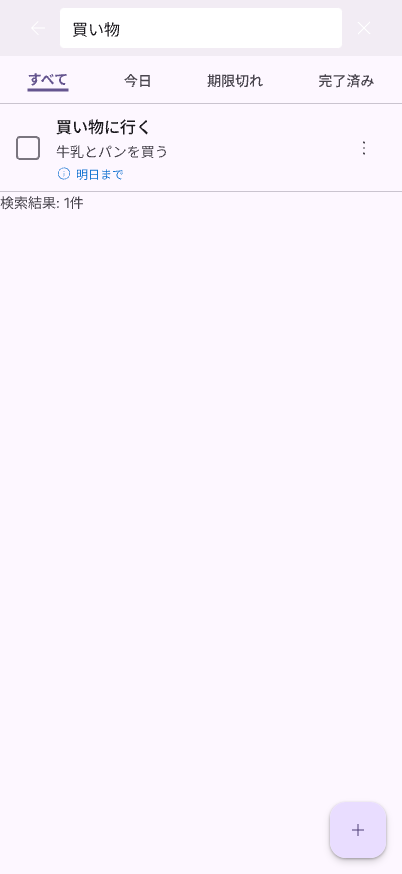
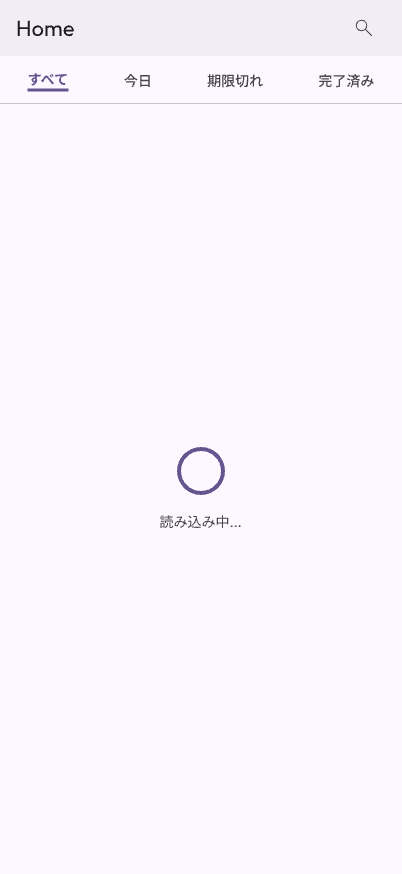
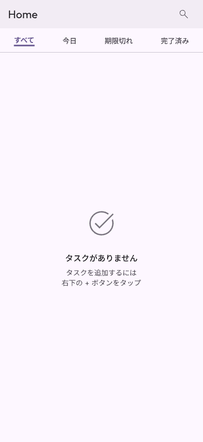
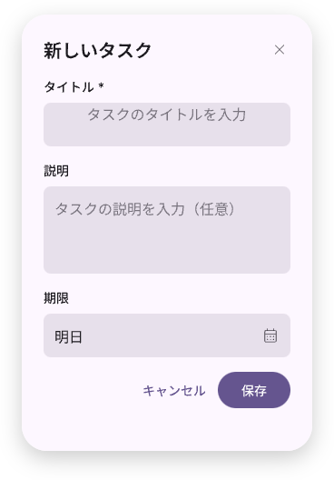
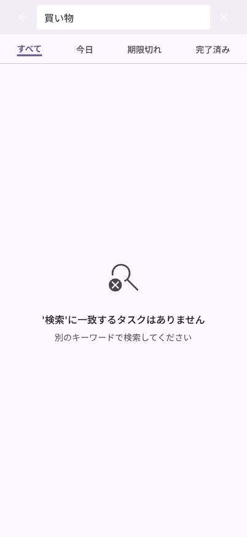
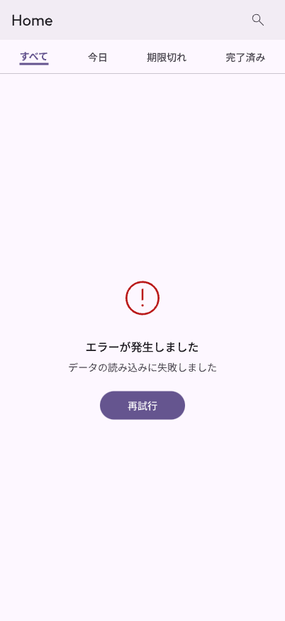
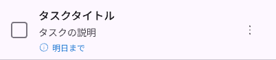

# タスクホーム画面 UI/UX設計書

## ドキュメント情報

- **作成日**: 2026-01-26
- **最終更新**: 2026-01-26
- **ステータス**: 承認済み（更新済み）
- **デザインシステム**: Material Design 3
- **関連ドキュメント**:
  - [UI/UXデザインガイドライン](../../common/ui-design-guidelines.md)
  - [カラーシステム定義](../../common/color-system.md)
  - [機能仕様書](../features/task-management-home.md)
  - [ADR-0002](../architecture/decisions/0002-task-home-screen-design.md)
- **Pencilデザイン**: ✅ 完了 - [designs/task-home-screen.pen](../../designs/task-home-screen.pen)

## 1. 画面概要

タスク管理アプリのホーム画面のUI/UX設計を定義します。カテゴリ別タブ型のデザインを採用し、ユーザーが直感的にタスクを管理できる画面を提供します。

**デザインシステム**: Material Design 3 (MD3) の標準コンポーネントを使用し、[UI/UXデザインガイドライン](../../common/ui-design-guidelines.md) に準拠します。

## 2. ワイヤーフレーム

> **注意**: 以下の画面デザインは [designs/task-home-screen.pen](../../designs/task-home-screen.pen) で作成されています。

### 2.1 全体レイアウト（すべてタブ）



**画面構成**:
- AppBar (高さ: 56pt): タイトル「Home」と検索アイコン
- TabBar (高さ: 48pt): 4つのタブ（すべて、今日、期限切れ、完了済み）
- TaskList: スクロール可能なタスクリスト（各タスク高さ: 88pt）
- FAB (直径: 56pt): 右下の追加ボタン

### 2.2 検索状態



**画面構成**:
- SearchBar: 戻るボタン、検索フィールド、クリアボタン
- TabBar: 通常時と同じタブ表示
- TaskList: 検索結果に一致するタスクのみ表示
- 検索結果件数の表示

### 2.3 ローディング状態



**画面構成**:
- AppBar、TabBarは通常時と同じ
- コンテンツ領域: 中央に CircularProgressIndicator (48x48pt) と「読み込み中...」テキスト

### 2.4 空状態



**画面構成**:
- AppBar、TabBarは通常時と同じ
- コンテンツ領域: 中央に空状態アイコン (task_alt, 64x64pt)、メッセージ「タスクがありません」、説明テキスト
- FAB: 通常時と同じ

### 2.5 タスク追加ダイアログ



**ダイアログ構成** (320x480pt):
- ヘッダー: タイトル「新しいタスク」と閉じるボタン
- タイトルフィールド: 必須入力（*マーク付き）
- 説明フィールド: 任意入力、複数行対応
- 期限フィールド: DatePickerアイコン付き
- アクション: キャンセルボタン、保存ボタン（Primary色）

### 2.6 検索結果0件状態



**画面構成**:
- SearchBar: 通常の検索状態と同じ
- TabBar: 通常時と同じタブ表示
- コンテンツ領域: 中央に検索アイコン (`Icons.search_off`, 64x64pt、`onSurfaceVariant`色)、メッセージ「'（クエリ）'に一致するタスクはありません」、説明テキスト「別のキーワードで検索してください」

**注**: 空状態（タスクが1つもない）とは異なり、検索クエリに一致するタスクがない状態です。

### 2.7 エラー状態



**画面構成**:
- AppBar、TabBarは通常時と同じ
- コンテンツ領域: 中央にエラーアイコン (error, 64x64pt、Error色)、エラーメッセージ「エラーが発生しました」、説明テキスト「データの読み込みに失敗しました」
- 再試行ボタン: Primary色のボタン

## 3. 画面要素の詳細

### 3.1 AppBar

**コンポーネント**: Material Design 3 `AppBar`

| 要素 | 仕様 |
|------|------|
| **高さ** | 56pt (iOS: 44pt + ステータスバー) |
| **背景色** | `colorScheme.surfaceContainer` (**MD3推奨**：コンテンツとの自然な区別を提供) |
| **タイトル** | "Home" (左寄せ) |
| **タイトルスタイル** | `textTheme.titleLarge` (22pt, Medium 500) |
| **タイトル色** | `colorScheme.onSurface` |
| **検索アイコン** | 右側に配置、タップで検索モードに切り替え、色: `colorScheme.onSurfaceVariant` |
| **戻るボタン** | 検索モード時のみ表示、色: `colorScheme.onSurfaceVariant` |
| **Elevation** | 0 (初期状態)、`scrolledUnderElevation`: 3 (スクロール時) |

**実装**: `Theme.of(context).colorScheme.surfaceContainer` と `Theme.of(context).textTheme.titleLarge` を使用してください。スクロール時の動的な変化を実現するため、`SliverAppBar`の使用を推奨します。

#### AppBarの状態遷移

```
[通常モード]
    │
    │ 検索アイコンタップ
    ▼
[検索モード]
    │
    │ 戻るボタンタップ
    ▼
[通常モード]
```

### 3.2 TabBar

**コンポーネント**: Material Design 3 `TabBar`

| 要素 | 仕様 |
|------|------|
| **高さ** | 48pt |
| **タブ数** | 4つ（すべて、今日、期限切れ、完了済み） |
| **配置方法** | `justifyContent: space_around`（各タブの左右に均等な余白を配置） |
| **選択インジケーター** | 下線（`colorScheme.primary`、高さ: 2pt） |
| **非選択タブ** | `colorScheme.onSurfaceVariant` |
| **選択タブ** | `colorScheme.primary` |
| **テキストスタイル** | `textTheme.labelLarge` (14pt, Medium 500) |
| **選択時フォントウェイト** | Bold (700) |

**実装**: MD3の `TabBar` を使用し、`labelStyle` と `unselectedLabelStyle` でスタイルを設定してください。

#### タブの内容

| タブ名 | 表示条件 | バッジ表示 |
|--------|---------|-----------|
| **すべて** | 全タスク | タスク総数 (99+は"99+") |
| **今日** | `dueDate == 今日` | 該当タスク数 (99+は"99+") |
| **期限切れ** | `dueDate < 今日 && !isCompleted` | 該当タスク数（赤色、99+は"99+"） |
| **完了済み** | `isCompleted == true` | なし |

**注**: バッジの上限を99+とすることで、モバイルUIの標準的なプラクティスに準拠します。

### 3.3 TaskListView

| 要素 | 仕様 |
|------|------|
| **タイプ** | ListView.builder（垂直スクロール） |
| **区切り線** | 各タスク間に薄いグレーの線（高さ: 1px） |
| **パディング** | 上下: 8pt、左右: 16pt |
| **スクロールバー** | iOS: 自動非表示、Android: 常に表示 |

### 3.4 TaskListTile

**コンポーネント**: Material Design 3 `ListTile` (カスタマイズ)

#### レイアウト



**構成要素**:
- **Checkbox** (24x24pt): 左端に配置
- **テキスト情報** (中央): タイトル、説明、期限表示
- **メニューボタン** (24x24pt): 右端に配置
- **全体の高さ**: 88pt
- **パディング**: 16pt

#### 要素の詳細

| 要素 | 仕様 |
|------|------|
| **Checkbox** | MD3 `Checkbox`、サイズ: 24x24pt、左端から16pt |
| **タイトル** | `textTheme.titleMedium` (16pt, Medium 500) |
| **説明** | `textTheme.bodyMedium` (14pt)、色: `colorScheme.onSurfaceVariant`、最大2行で省略 |
| **期限表示** | `textTheme.bodySmall` (12pt)、色: 期限に応じて変化 |
| **メニューボタン** | MD3 `IconButton` (icon: `more_vert`)、右端から8pt |
| **タップ領域** | タイル全体（最小44x44pt） |

#### 期限表示のスタイル

**アクセシビリティ要件**: WCAG 2.1 AA準拠のため、**色だけでなく、必ずアイコンとテキストを併用**してください。色のみに依存した情報伝達は、色覚特性を持つユーザーにとって識別困難です。

**実装**: [カラーシステム定義](../../common/color-system.md#41-タスク期限表示のカラーマッピング) を参照してください。

| 条件 | MD3トークン/セマンティック | アイコン | 表示テキスト |
|------|-------------------------|---------|------------|
| **期限切れ** | `error` | `Icons.error_outline` (16pt) | 「期限切れ」 + 日付 |
| **今日** | `warning` | `Icons.schedule` (16pt) | 「今日まで」 |
| **明日** | `info` | `Icons.info_outline` (16pt) | 「明日まで」 |
| **1週間以内** | `onSurfaceVariant` | なし | 「○日後」または日付 |
| **1週間以降** | `outline` | なし | 日付のみ |
| **期限なし** | `outline` | なし | 非表示または「期限なし」 |

**レイアウト**: `[アイコン(16pt)] [テキスト(12pt)]` の横並び配置、アイコンとテキストの間隔: 4pt

#### 完了タスクのスタイル

| 要素 | スタイル | MD3トークン |
|------|---------|------------|
| **Checkbox** | チェック済み | MD3 `Checkbox` (checked) |
| **タイトル** | 取り消し線、色: グレー | `onSurfaceVariant` |
| **説明** | 色: 薄いグレー | `outline` |
| **期限** | 「完了」と表示 | `success`（[カラーシステム定義](../../common/color-system.md#21-success成功)参照） |

### 3.5 FloatingActionButton (FAB)

**コンポーネント**: Material Design 3 `FloatingActionButton`

| 要素 | 仕様 |
|------|------|
| **サイズ** | 直径: 56pt (MD3 標準) |
| **位置** | 右下、マージン: 右16pt、下16pt |
| **アイコン** | `Icons.add` (プラス記号) |
| **背景色** | `colorScheme.primaryContainer` |
| **前景色** | `colorScheme.onPrimaryContainer` |
| **影** | Elevation: 6 (MD3 標準) |
| **タップ時** | タスク追加ダイアログを表示 |

**実装**: `FloatingActionButton` を使用し、テーマのカラースキームを自動適用してください。

### 3.6 タスク追加ダイアログ

**コンポーネント**: Material Design 3 `Dialog`

| 要素 | 仕様 | MD3トークン |
|------|------|------------|
| **サイズ** | 幅: 320pt（最大）、高さ: 自動 | - |
| **背景** | `colorScheme.surface` | ライト: 白、ダーク: ダークグレー |
| **角丸** | 28pt (MD3 標準) | - |
| **パディング** | 24pt | - |
| **タイトル** | "新しいタスク" / "タスクを編集" | `textTheme.headlineSmall` (24pt) |

#### フィールド詳細

| フィールド | 仕様 | MD3コンポーネント |
|-----------|------|------------------|
| **タイトル** | 最大200文字、必須（*表示） | MD3 `TextField` |
| **説明** | 複数行（最大5行）、最大1000文字 | MD3 `TextField` (multiline) |
| **期限** | タップでカレンダー表示 | MD3 `TextField` + DatePicker |
| **保存ボタン** | タイトル未入力時は無効化 | MD3 `FilledButton` (disabled状態) |
| **キャンセルボタン** | - | MD3 `TextButton` |
| **ボタン配置** | 右寄せ（trailing alignment） | - |

**実装**: `showDialog` と MD3の `Dialog` Widget を使用してください。ボタンは `FilledButton` (保存) と `TextButton` (キャンセル) を使用し、両方のボタンを含むアクションエリアは右寄せで配置します。

## 4. ユーザーインタラクション

### 4.1 タスク操作フロー

#### タスク追加

```
[ホーム画面]
    │ FABタップ
    ▼
[追加ダイアログ表示]
    │ タイトル入力
    │ (説明・期限は任意)
    ▼
[保存ボタンタップ]
    │
    ▼
[ダイアログ閉じる]
    │
    ▼
[タスクリストに追加]
    │ アニメーション: フェードイン
    ▼
[完了]
```

#### タスク完了

```
[タスクリスト表示]
    │ Checkboxタップ
    ▼
[完了状態に更新]
    │ アニメーション: チェックマーク
    │ スタイル変更: 取り消し線、グレー色
    ▼
[「完了済み」タブに移動可能]
```

#### タスク削除（メニュー経由）

```
[タスクリスト表示]
    │ メニューボタンタップ
    ▼
[メニュー表示]
    │ "削除" 選択
    ▼
[タスクを削除（確認ダイアログなし）]
    │ アニメーション: フェードアウト
    │ Snackbar表示: 「タスクを削除しました」+ Undoボタン (5秒間)
    ▼
[完了]
```

**注**: 確認ダイアログは使用せず、代わりにUndoボタン付きSnackbarで誤操作に対応します。これにより、頻繁な操作でのストレスを軽減します。

**推奨**: 多くの場合、**左スワイプでの削除**の方が効率的です（セクション4.4参照）。

### 4.2 検索フロー

```
[ホーム画面]
    │ 検索アイコンタップ
    ▼
[検索モードに切り替え]
    │ AppBarが SearchBar に変化
    │ キーボード表示
    ▼
[検索クエリ入力]
    │ リアルタイムでフィルタリング
    ▼
[検索結果表示]
    │ 該当タスクのみ表示
    │ 結果数を表示
    ▼
[戻るボタンタップ]
    │
    ▼
[通常モードに戻る]
    │ 全タスク表示
    ▼
[完了]
```

### 4.3 タブ切り替えフロー

```
[現在のタブ]
    │ 別のタブをタップ
    ▼
[TabBarView がスライド]
    │ アニメーション: 300ms
    │ Curve: easeInOut
    ▼
[新しいタブの内容を表示]
    │ フィルタリング済みタスクリスト
    ▼
[完了]
```

### 4.4 スワイプジェスチャー

タスク操作の効率化のため、**スワイプジェスチャー**を提供します。これにより、Things 3やTodoistと同等の快適なUXを実現します。

#### 右スワイプ（完了/未完了切り替え）

```
[タスクリスト表示]
    │ 右にスワイプ（50pt以上）
    ▼
[背景に完了アイコン表示（緑色）]
    │ スワイプ完了
    ▼
[タスク完了状態に切り替え]
    │ アニメーション: チェックマーク + フェードアウト
    │ Snackbar表示: 「タスクを完了しました」+ Undoボタン
    ▼
[完了済みタブに移動可能]
```

**仕様**:
- スワイプ閾値: 50pt以上で完了アクション発動
- 背景色: `colorScheme.successContainer`
- 背景アイコン: `Icons.check_circle` (48pt)、色: `colorScheme.success`
- 完了済みタスクを右スワイプした場合: 未完了に戻す

#### 左スワイプ（削除）

```
[タスクリスト表示]
    │ 左にスワイプ（50pt以上）
    ▼
[背景に削除アイコン表示（赤色）]
    │ スワイプ完了
    ▼
[タスク削除]
    │ アニメーション: フェードアウト
    │ Snackbar表示: 「タスクを削除しました」+ Undoボタン (5秒間)
    ▼
[完了]
```

**仕様**:
- スワイプ閾値: 50pt以上で削除アクション発動
- 背景色: `colorScheme.errorContainer`
- 背景アイコン: `Icons.delete_outline` (48pt)、色: `colorScheme.error`
- **確認ダイアログなし** → Undo機能で代替

#### Undoアクション

削除または完了操作後、5秒間Snackbarを表示し、Undoボタンで操作を取り消せます。

**Snackbar仕様**:
- 背景色: `colorScheme.inverseSurface`
- テキスト色: `colorScheme.onInverseSurface`
- アクションボタン: 「元に戻す」、色: `colorScheme.inversePrimary`
- 表示時間: 5秒
- 位置: 画面下部、FABの上（マージン: 16pt）

**実装**: Flutterの `Dismissible` Widgetを使用し、`onDismissed`コールバックでSnackBarを表示してください。

## 5. 状態遷移

### 5.1 画面の状態

```
          ┌──────────┐
          │  初期化  │
          └────┬─────┘
               │
               ▼
       ┌──────────────┐
       │ ローディング │
       └──────┬───────┘
              │
         ┌────┴────┐
         │         │
    エラー?      成功?
         │         │
         ▼         ▼
    ┌────────┐ ┌──────────┐
    │ エラー │ │ データ表示│
    └────┬───┘ └────┬─────┘
         │           │
    再試行タップ   タスク数?
         │           │
         └───────┬───┴──────┐
                 │          │
             タスク有?   タスク無?
                 │          │
                 ▼          ▼
          ┌──────────┐ ┌─────────┐
          │ リスト表示│ │ 空状態  │
          └──────────┘ └─────────┘
```

### 5.2 タスクの状態

```
     ┌──────────┐
     │ 未作成   │
     └────┬─────┘
          │ 追加
          ▼
     ┌──────────┐
     │ 未完了   │◄─────┐
     └────┬─────┘      │
          │ 完了       │ 未完了に戻す
          ▼            │
     ┌──────────┐      │
     │ 完了済み │──────┘
     └────┬─────┘
          │ 削除
          ▼
     ┌──────────┐
     │ 削除済み │
     └──────────┘
```

## 6. アニメーション

### 6.1 タブ切り替え

| プロパティ | 値 |
|-----------|-----|
| **Duration** | 300ms |
| **Curve** | Curves.easeInOut |
| **効果** | 水平スライド |

### 6.2 タスク追加

| プロパティ | 値 |
|-----------|-----|
| **Duration** | 200ms |
| **Curve** | Curves.easeIn |
| **効果** | フェードイン + スライドダウン |

### 6.3 タスク削除

| プロパティ | 値 |
|-----------|-----|
| **Duration** | 250ms |
| **Curve** | Curves.easeOut |
| **効果** | フェードアウト + スライドアップ |

### 6.4 Checkbox トグル

| プロパティ | 値 |
|-----------|-----|
| **Duration** | 150ms |
| **Curve** | Curves.bounceOut |
| **効果** | チェックマークのアニメーション |

## 7. レスポンシブデザイン

### 7.1 画面サイズ対応

| 画面サイズ | レイアウト調整 |
|-----------|--------------|
| **スマートフォン（〜600pt）** | 標準レイアウト |
| **タブレット（600pt〜）** | 左右にマージン追加（最大幅: 720pt） |

### 7.2 向きの対応

| 向き | レイアウト |
|------|-----------|
| **縦向き** | 標準レイアウト |
| **横向き** | FABを右端中央に配置 |

## 8. アクセシビリティ

### 8.1 セマンティクスラベル

| 要素 | ラベル |
|------|-------|
| **Checkbox** | "タスクを完了としてマーク" / "タスクを未完了に戻す" |
| **FAB** | "新しいタスクを追加" |
| **検索アイコン** | "タスクを検索" |
| **メニューボタン** | "タスクのオプション" |
| **タブ** | "すべてのタスク" / "今日のタスク" など |

### 8.2 コントラスト比

すべてのテキストとアイコンはWCAG 2.1 AAレベル（4.5:1以上）を満たす必要があります。

### 8.3 タップ領域

すべてのインタラクティブ要素は最小44x44ptのタップ領域を確保します。

## 9. ダークモード対応

**重要**: ハードコードされた色は使用せず、必ず `Theme.of(context).colorScheme.*` を使用してください。

| 要素 | MD3トークン |
|------|------------|
| **背景** | `background` |
| **テキスト** | `onBackground` |
| **区切り線** | `outlineVariant` |
| **AppBar** | `primary` |
| **Surface** | `surface` |

**実装例**:
```dart
Container(
  color: Theme.of(context).colorScheme.background,
  child: Text(
    'テキスト',
    style: TextStyle(color: Theme.of(context).colorScheme.onBackground),
  ),
)
```

**カラーの具体的な値**: [カラーシステム定義](../../common/color-system.md) を参照してください。

詳細は [UIガイドライン - ダークモード対応](../../common/ui-design-guidelines.md#22-ダークモード対応) も参照してください。

## 10. Pencilデザインファイル

> 🚧 **TODO**: 詳細なビジュアルデザインをPencilで作成予定

### 作成予定の画面

- **ファイルパス**: `designs/task-home-screen.pen`
- **含まれる画面**:
  - ✅ すべてタブ（通常状態）- 4つのタスク表示（期限切れ、今日、1週間後、完了）
  - ✅ 今日タブ - 今日期限のタスクのみ表示
  - ✅ 期限切れタブ - 期限切れタスクのみ表示（赤色強調）
  - ✅ 完了済みタブ - 完了済みタスクのみ表示
  - ✅ 検索状態 - 検索バーと結果表示
  - ✅ 検索結果0件状態 - 検索アイコンと案内メッセージ
  - ✅ タスク追加ダイアログ - タイトル、説明、期限入力フォーム
  - ✅ ローディング状態 - スピナーと読み込み中テキスト
  - ✅ 空状態 - アイコンと案内メッセージ
  - ✅ エラー状態 - エラーアイコンと再試行ボタン

### デザイン要件

- **画面サイズ**: 402x874pt (モバイル標準)
- **カラーシステム**: モノクロ（黒/白/グレー階調）
- **フォント**: Outfit（見出し）、Inter（本文）
- **アイコン**: Lucide icon set
- **MD3準拠**: Material Design 3のコンポーネントとトークンを使用

## 11. 参考資料

### プロジェクト内

- [UI/UXデザインガイドライン](../../common/ui-design-guidelines.md) - **必読**: MD3コンポーネント、タイポグラフィ、レイアウト
- [カラーシステム定義](../../common/color-system.md) - **必読**: MD3カラートークン、セマンティックカラーの具体的な値

### Material Design 3

- [Material Design 3 公式サイト](https://m3.material.io/)
- [MD3 - Lists](https://m3.material.io/components/lists/overview)
- [MD3 - Tabs](https://m3.material.io/components/tabs/overview)
- [MD3 - Floating Action Button](https://m3.material.io/components/floating-action-button/overview)
- [MD3 - Dialogs](https://m3.material.io/components/dialogs/overview)

### Flutter

- [Flutter Material Components](https://docs.flutter.dev/ui/widgets/material)
- [Flutter テーマ設定](https://docs.flutter.dev/cookbook/design/themes)

### その他

- [Human Interface Guidelines - Lists and Tables](https://developer.apple.com/design/human-interface-guidelines/lists-and-tables)

## 12. 変更履歴

| 日付 | バージョン | 変更内容 | 著者 |
|------|-----------|----------|------|
| 2026-01-26 | 1.0 | 初版作成 | Claude Code |
| 2026-01-26 | 1.1 | MD3準拠に更新、カラートークン・タイポグラフィをMD3仕様に対応 | Claude Code |
| 2026-01-26 | 1.2 | PencilデザインをTODOとして記載 | Claude Code |
| 2026-01-26 | 1.3 | カラーシステム定義を参照するように更新、具体的な色の値を削除 | Claude Code |
| 2026-01-26 | 1.4 | Pencilデザイン完了、ASCII図を実際の画面スクリーンショットに置き換え | Claude Code |
| 2026-01-26 | 1.5 | Geminiレビュー反映：AppBar背景色をsurfaceContainerに変更、アクセシビリティ改善（期限表示に色+アイコン+テキスト追加）、UX改善（スワイプ操作・Undo付きSnackbar追加）、検索結果0件状態追加、Dialog角丸28pt・TabBarバッジ99+に修正 | Claude Code |
| 2026-01-26 | 1.6 | リードデザインエンジニアレビュー反映：TaskListTile高さを72pt→88ptに修正、セクション10の進捗状況を更新（すべての画面が完成済み）、検索結果0件状態を明記 | Claude Code |
| 2026-01-26 | 1.7 | セクション2.6「検索結果0件状態」に画像参照を追加（images/all-tasks-search-no-results.png） | Claude Code |
